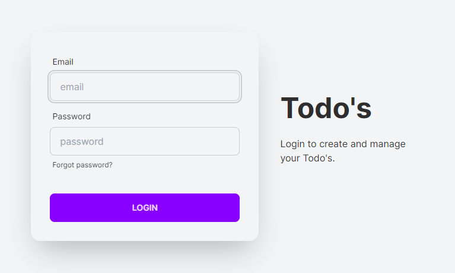

## Todos - Managing your Todo's

This is a simple app build with Next.js, Tailwind and Prisma for managing todo's



## Usage

Rename the example.env & example.env.local file to .env and env.local and enter the required data like the mysql connection string or the token secret.

Install dependencies

```bash
npm install
```

Run the server

```bash
npm run dev
```

Visit `http://localhost:3000` in your browser.
